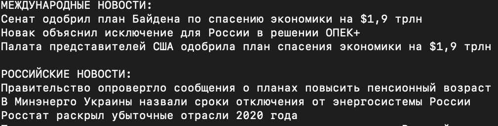

## Классификатор экономических новостей

Данная программа классифицирует последние 20 экономических новостей с сайта РБК на две категории - иностранные новости (World) и российские новости (Russia).

### Шаги работы программы: 

1. Парсинг текстов последних 20 экономических новостей с сайта РБК
2. Предобработка текстов, включающая лемматизацию и исключение спец.символов
3. Получение векторных представлений текстов с использованием предобученного TFIDF
4. Классификация текстов с помощью предобученной логистической регрессии

###

